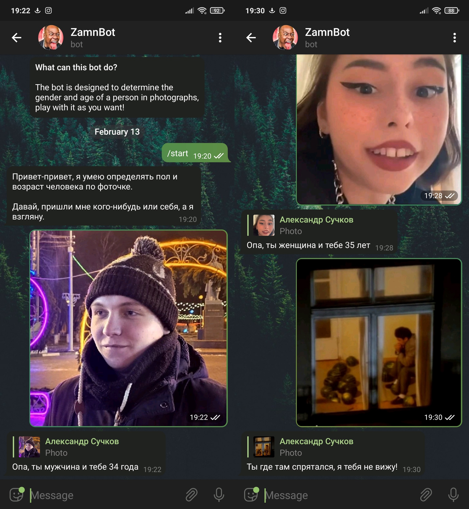

# Computer-Networks-Course-Project-2022

```
4th course, IU7
Bauman Moscow State Technical University
```

## Описание

Telegram бот определяющий пол и возраст по фотографии на основе свёрточной нейронной сети YOLO. Реализованы команды `/start` и `/help`, отправка фотографий и дальнейшая их обработка, также реализованы всякие `преколы` забавы ради.

#### Оценка - могла быть пытёрка, но поставили четвёрочку

## Технологический стек

Язык: Python

Библиотека: Telebot

Свёрточная нейронная сеть: YOLO

## Работа основана на репозиториях

[Репозиторий с реализацией нейронной сети определения возраста и пола](https://github.com/abars/YoloKerasFaceDetection)

[Вдохновивший репозиторий](https://github.com/anastasialavrova/bmstu_computer_networks_course_work)

## Скриншотики


